<!-- README.md is generated from README.Rmd. Please edit that file -->

# Werner Colours <a href="https://github.com/spiritu-santi/WernerColors">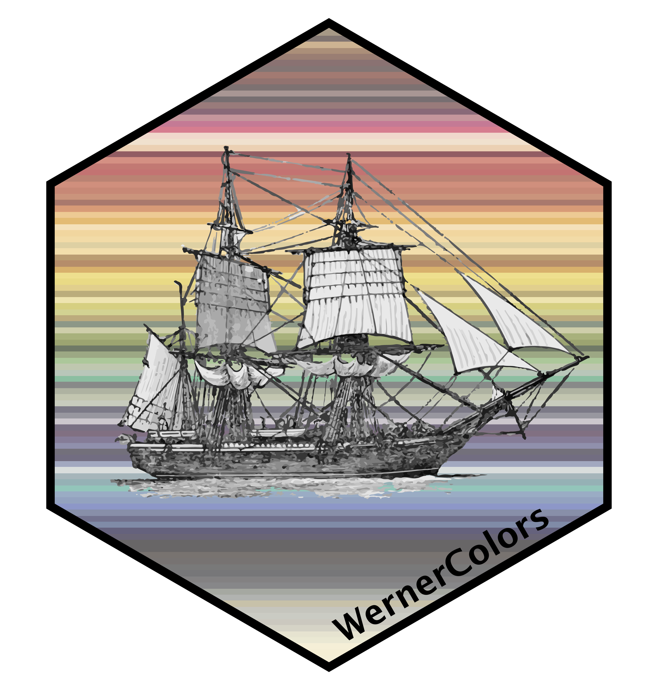</a>

<!-- badges: start -->
<!-- badges: end -->

Color palettes inspired by ‘Werner’s Nomenclature of Colours. Adapted to
Zoology, Botany, Chemistry, Mineralogy, Anatomy, and the Arts. By
Patrick Syme’. The palette represents one of the world’s firs taxonomy
of colours (110 in total) that are grouped in 10 component parts. Every
color has a given a number and name, and associated examples of
‘animals’, ‘vegetables’, and ‘minerals’. This is the basis of the
‘Special palettes’.

Werner’s taxonomy of colours was used by Charles Darwin during the
travels of the HMS Beagle to describe natural scenes and animals in a
consistent manner. The ‘Beagle’ palettes are inspired by Darwin’s ‘The
Voyage of the Beagle’ and the colours mentioned to describe scenery,
plants or animals, although colours have to be adjusted to make for
nicer palettes.

**Currently working my way through the Voyage to construct these
palettes and will be uploading new palettes accordingly.**

## Installation

You can install the development version of WernerColors from
[Github](https://github.com/spiritu-santi/WernerColors) with:

``` r
# install.packages("devtools")
devtools::install_github("spiritu-santi/WernerColors")
```

## Usage

Available palette names:

|           | Special                       |         | Component                   |
|----------:|-------------------------------|--------:|-----------------------------|
|     Rocks |      |  whites | 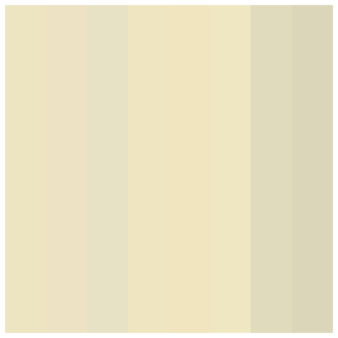  |
|    Plants |     |   greys | 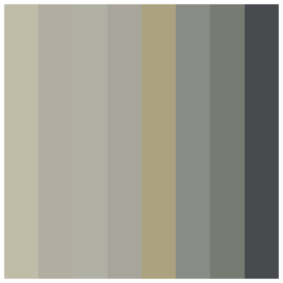   |
|     Birds | 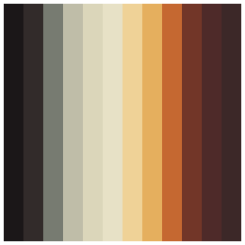     |  blacks |   |
|      Bugs | 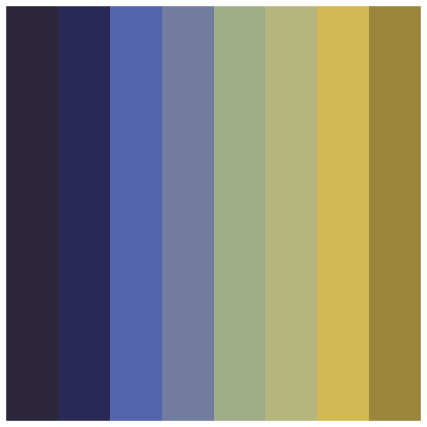      |   blues | 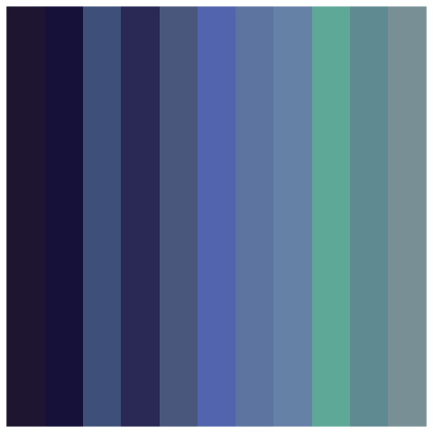   |
|     Bugs2 | 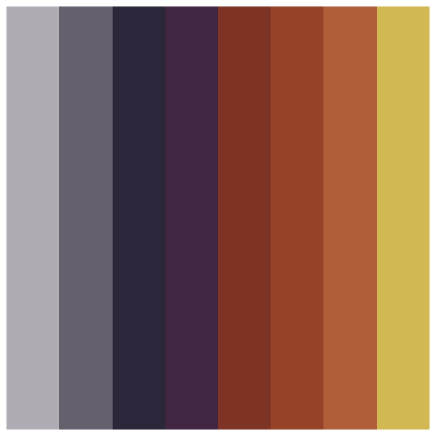     | purples | 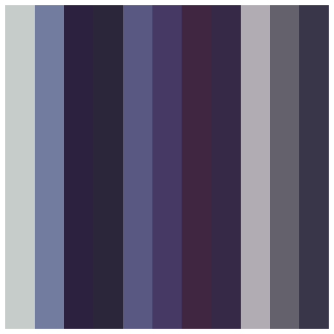 |
| Firebirds | 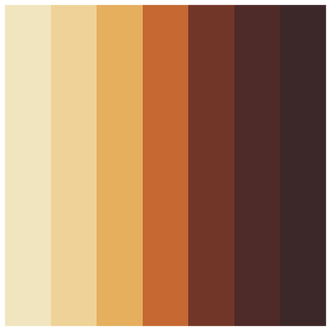 |  greens | 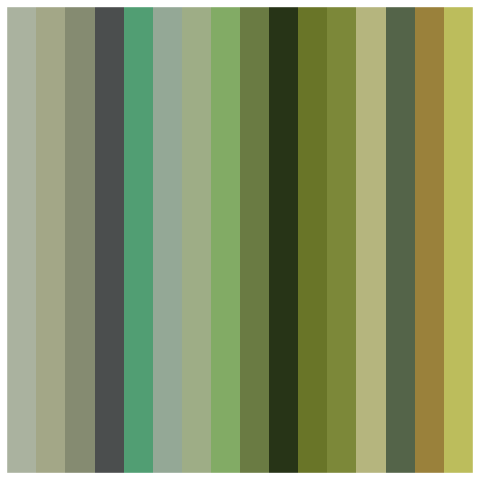  |
| Greybirds | 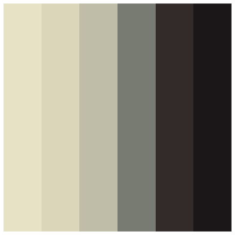 | yellows | 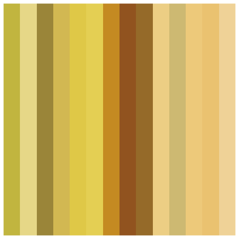 |
|     Seeds | 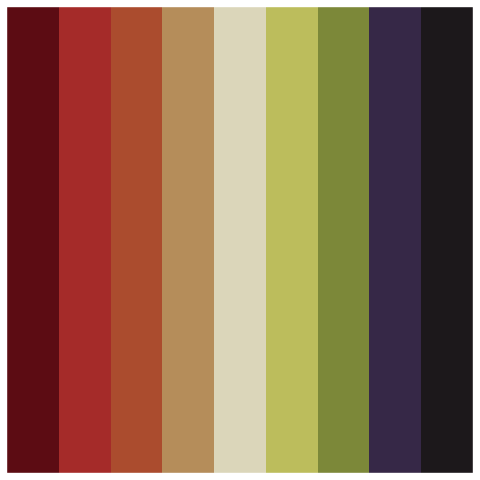     |  orange | 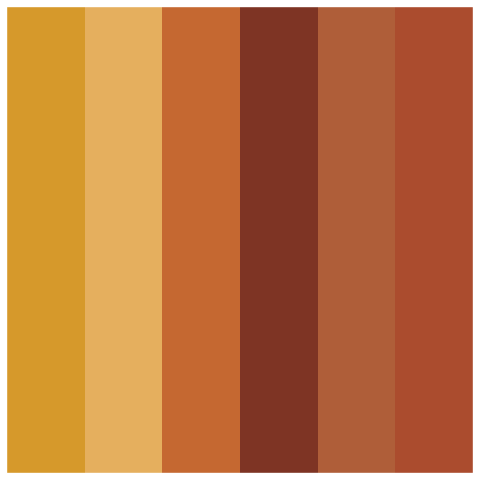  |
|    Apples | 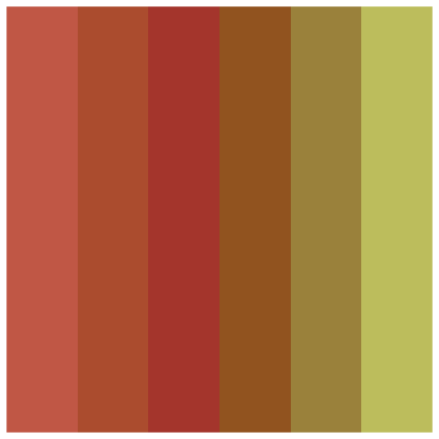    |    reds | 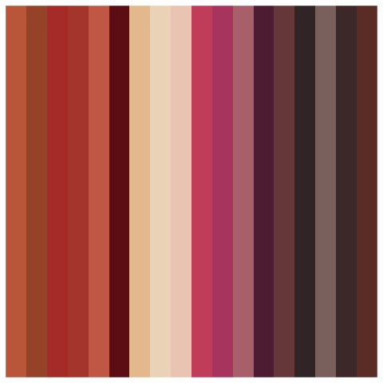    |
|    Leaves | 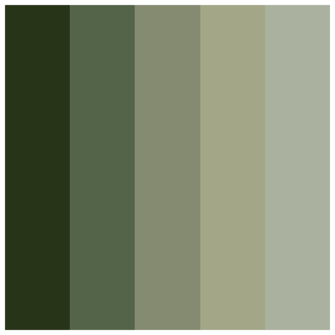    |  browns | 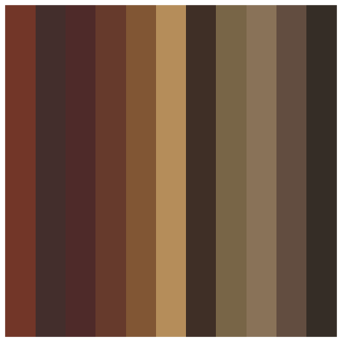  |

Available Voyage palettes:

|            | Chapter 1                      |
|-----------:|--------------------------------|
|   CapeVerd | 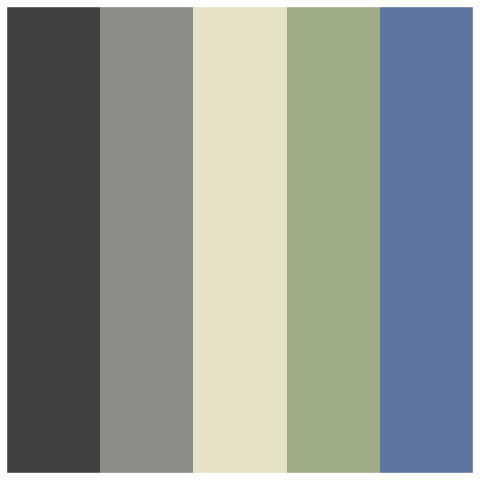   |
| CuttleFish | 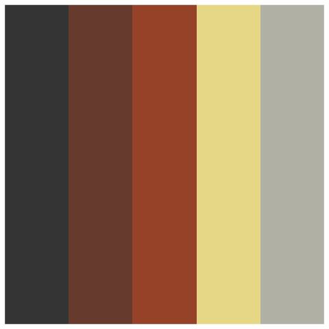 |

Palettes can be retrieved with the methods below.

``` r
# For discrete scales. 
werner_brewer("Firebirds", n = 7, type = "discrete", direction = 1, return_hex=FALSE)

# For continuous scales and more colours. 
werner_brewer("Bugs", n = 14, type = "continuous", direction = 1, return_hex=FALSE)
```

Or palettes can be incorporated into ‘ggplot’

``` r
# For discrete scales. 
scale_color_werner_d("Firebirds", direction = 1, n = 7)
scale_fill_werner_d("Firebirds", direction = 1, n = 7)

# For continuous scales. 
scale_color_werner_c("Bugs", direction = 1, n = 7)
scale_fill_werner_c("Bugs", direction = 1, n = 7)
```

### Example

This is a basic example to generate a plot with a set of colours.  
User provides the name of the palette and then integrates the palette
through the use of scale\_\*\_manual.

``` r
library(ggplot2)
colors <- werner_brewer("Firebirds")
data = tibble(A = 1:7, B = LETTERS[1:7])

ggplot(data, aes(x=A,y=B,fill=B)) + 
    geom_bar(stat="identity") + 
    scale_fill_manual(values=colors) + 
    theme_void() + 
    NULL

# Alternatively
ggplot(data, aes(x=A,y=B,fill=B)) + 
    geom_bar(stat="identity") + 
    scale_fill_werner_d("Bugs", n = 7) + 
    theme_void() + 
    NULL
```

## Colorblind Friendly Checking

The package is being updated to check for colorblind-friendlyness.

## Issues and comments

Feel free to reach out to me:<br /> Email: <santiago.ramirez@ib.unam.mx>
